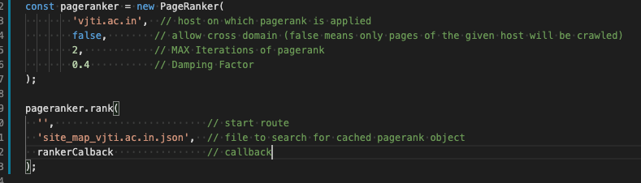
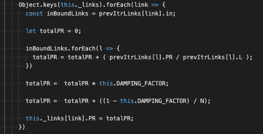
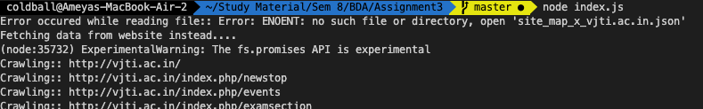
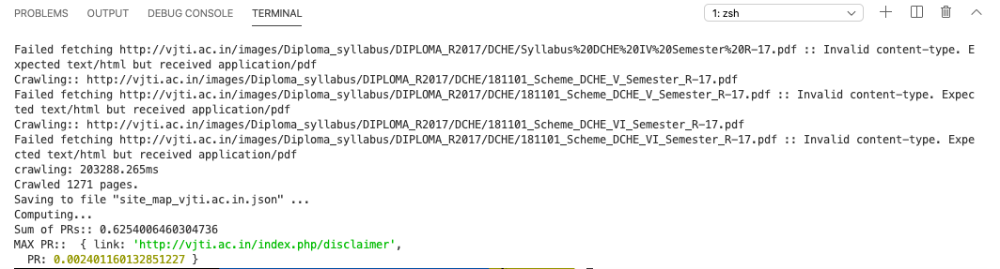

# Assignment 3 (Big Data Analysis)

This repo is my implementation of the PageRank Algorithm.

### About the Crawler
1. Makes HTTP requests. Finds next links by searching for the `href` attribute of the `` tag.
2. All URLs sanitzied using the `url.parse` and `url.format` of the [URL](https://nodejs.org/api/url.html) module.
3. Crawler checks for `content-type`. Sends empty outBound links array for non-HTML contents.

### About the PageRaker
1. The async actions of PageRanker are maintained using 4 events viz. 
  - `append`(notifies when next set of links are ready to be crawled)
  - `save` (called after all pages have been crawled and the links are ready to be saved)  
  - `compute`(calls after the links object is instantiated and the PageRank can be applied)  
  - `release` (calls after the `compute` is done. Releases the eventHandlers and calls the `callback()`)

2. Tries to find of a cached version of crawler's result exists. If not, then it starts the `append` event which calls the crawler. 
3. Maintains `_linkQueue` which is made thread safe using [async-mutex](https://www.npmjs.com/package/async-mutex).
4. The `_handlePageVisit()` is called until the `_linkQueue` is empty.
5. Saves the crawled results to a new JSON file for furture use (because crawling can take 2-5 mins for a regular webiste). 

### Screenshots

### Issues
1. Currently the crawler supports HTTP only. HTTPS routes forced to use HTTP protocol instead.
2. Crawler will not work on websites relying on DOM manipulation. (e.g.: React, Angular, VueJS, etc.)
3. P.R. total not adding up correctly. Mostly an issue caused by the way how JS objects create copies.
