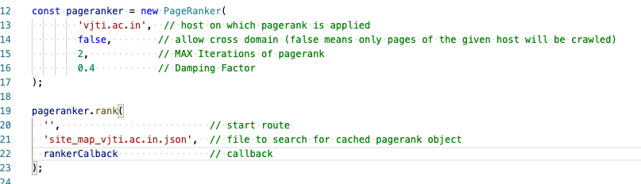
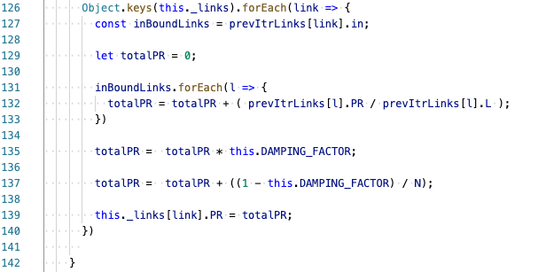

# Assignment 3 (Big Data Analysis)

This repo is my implementation of the PageRank Algorithm.

Currently, I took the liberty to crawl the [VJTI website](http://vjti.ac.in). One can change the code in `index.js` and easily crawl other websites too.

  _           | _
------------- | -------------
Name             | Ameya S. Daddikar
College I.D.     | 161070015
Department       | Computer Engineering
Year & Programme | Final Year B.Tech.


## How to run the code?
```
npm install       #install dependencies
node index.js     # make sure that the node version is at least v10.15.1
```


## Dependencies
 Package Name | Usage
------------- | -------------
[async-mutex](https://www.npmjs.com/package/async-mutex)| Safely handle async HTTP crawler requests by locking the `_linkQueue` object.
[jsdom](https://www.npmjs.com/package/jsdom)| Used by `src/linkcrawler.js` to extract links from the retrieved HTML page. 
[uuid](https://www.npmjs.com/package/uuid)| Generate unique ID for each PageRanker instance to avoid event-name colisions.


### About the LinkCrawler
1. Makes HTTP requests. Finds next links by searching for the `href` attribute of the `<a></a>` tag.
2. All URLs sanitzied using the `url.parse` and `url.format` of the [URL](https://nodejs.org/api/url.html) module.
3. Crawler checks for `content-type`. Sends empty outBound links array for non-HTML contents.

### About the PageRaker
1. The async actions of PageRanker are maintained using 4 events viz. 
  - `append`(notifies when next set of links are ready to be crawled)
  - `save` (called after all pages have been crawled and the links are ready to be saved)  
  - `compute`(calls after the links object is instantiated and the PageRank can be applied)  
  - `release` (calls after the `compute` is done. Releases the eventHandlers and calls the `callback()`)


2. Tries to find of a cached version of crawler's result exists. If not, then it starts the `append` event which calls the crawler. 
3. Maintains `_linkQueue` which is made thread safe using [async-mutex](https://www.npmjs.com/package/async-mutex).
4. The `_handlePageVisit()` is called until the `_linkQueue` is empty.
5. Saves the crawled results to a new JSON file for furture use (because crawling can take 2-5 mins for a regular webiste). 
6. Filters out visited sites and sites with hashPaths to save additional network calls.


### Screenshots
`index.js` code with comments explaining the various parameters required to instantiate and use the PageRanker class.


Snippet from `_handleCompute()` function inside `src/pageranker.js` that shows the algorithm steps applied. I've not used Matrices in my approach as I was unaware of that method. In hindsight, the current forEach is more time-consuming than the Matrix multiplication approach.


Start of output of the program. The pageranker tries to find the fie, however being unable to find it, the pageranker starts crawling the website instead.


Shows output after the crawling is done and the PageRank is calculated.


### Issues
1. Currently the crawler supports HTTP only. HTTPS routes forced to use HTTP protocol instead.
2. Crawler will not work on websites relying on DOM manipulation. (e.g.: React, Angular, VueJS, etc.)
3. P.R. total not adding up correctly. Mostly an issue caused by the way how JS objects create copies.
